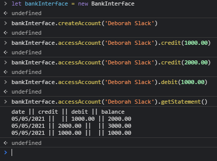
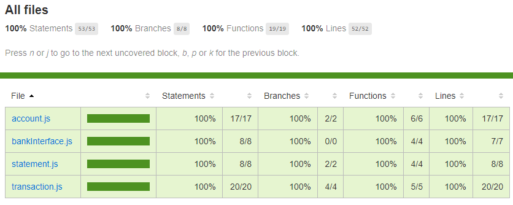
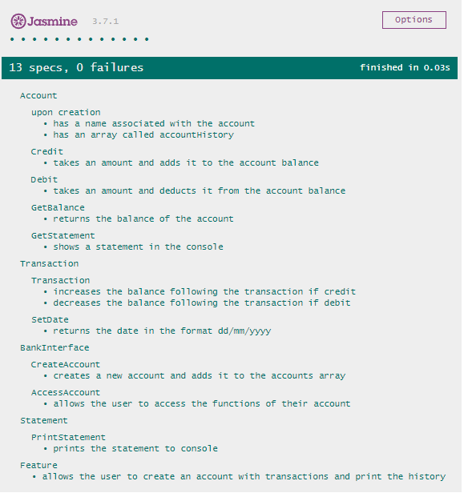

# Bank Tech Test [](https://travis-ci.com/StuBehan/bank-tech-test)

## Requirements 

* Interact with your code via the JavaScript console.
* Deposits, withdrawal.
* Account statement (date, amount, balance) printing.
* Data can be kept in memory (it doesn't need to be stored to a database or anything).


### Acceptance criteria

**Given** a client makes a deposit of 1000 on 10-01-2012
**And** a deposit of 2000 on 13-01-2012
**And** a withdrawal of 500 on 14-01-2012
**When** she prints her bank statement
**Then** she would see

```
date || credit || debit || balance
14/01/2012 || || 500.00 || 2500.00
13/01/2012 || 2000.00 || || 3000.00
10/01/2012 || 1000.00 || || 1000.00
```

## How to run

- Clone the repository
- Run `npm install`
- Run `npm test` to see tests or open the `specRunner.html`
- Open `specRunner.html` and open the console to enter commands
- Enter `let account = new Account('Jasmine')` to create an account
- Enter `account.transaction(500.00, 'credit')` to add a transaction
- Enter `account.transaction(250.00, 'debit')` to add a further transaction
- Enter `account.printStatement()` to see the printout

# Refactoring After Review

- I extracted the `Transaction` and `Statement` classes from the single class, `Account` that was managing everything. `Account` would then call upon these classes for functionality.
- `Account` itself would be accessed from the `BankInterface` class which is what the user will interact with. 
- I made sure to store transactions as numerical values instead of text so that they could be referenced later.
- I made it so that the `account.balance` was only stored in one place, the `_accountHistory` array.
- Through the refactoring I removed the possibility of erroneous transaction types by hard coding the types into the `credit` and `debit` functions of the `Account` class.
- I updated the feature test to demonstrate the Acceptance Criteria.

# Original Approach to Task

- I originally started trying to create a Bank class which created separate objects of another class, Account, but found the bank class would just be calling account all the time so removed it. 
- I envisioned the Account would start with an account name, but this is superfluous really, an empty account history Array and an empty balance.
- Simple if statements determine the kind of transaction and these are then returned as strings to 2 decimal places.
- The date is added using the `Date()` function, this is trimmed to exclude the time aspect that is returned by `Date()` and then hyphens are replaced with forward slashes, the format is reversed to `dd/mm/yyyy`.
- The print statement function needs to return a `console.log()` for each of the transactions in the history, so it will loop through them all and use object destructuring to easily access the data for the template literal output.

---
## Test Coverage 



---
## Testing Results

### Used Packages 

- eslint for linting
- babel as a parser for eslint
- jasmine for a testing library
- karma as a framework for testing with chrome remotely for CI integration
- instanbul for coverage, ran inside the karma framework